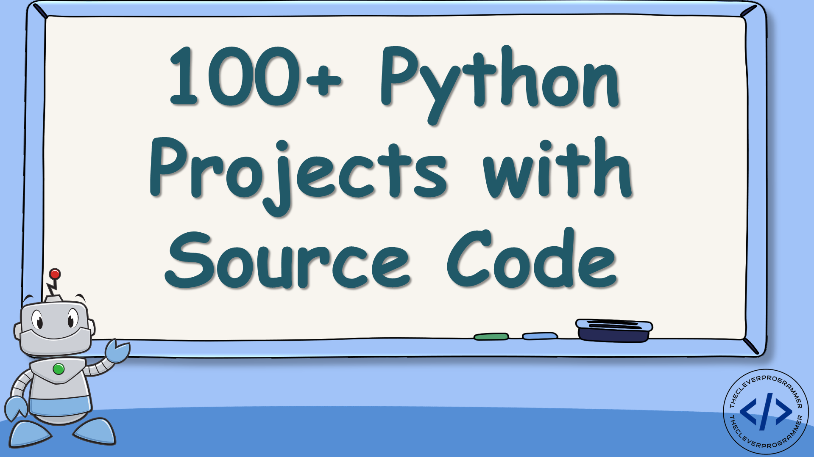

#                           100-days-of-python
#### Mastered Python by building 100 projects in 100 days. Experienced data science, automation, build websites, games and apps!
###### by Ahmet Aydın

## <i>My Projects</i>
<ol>
 <li>Band name generator</li>
 <li>Tip Calculator</li>
 <li>Treasure Island game</li>
 <li>Rock Paper Scissors</li>
 <li>Password Generator</li>
 <li>Escaping the Maze game</li>
 <li>Hangman Game</li>
 <li>Ceaser Cipher</li>
 <li>Auction Program</li>
 <li>Calculator</li>
 <li>Blackjack game</li>
 <li>Number Guessing game</li>
 <li>Debugging Challenge</li>
 <li>Higher Lower game</li>
 <li>Coffee Machine automation</li>
 <li>Object Oriented Programming</li>
 <li>Quiz Project</li>
 <li>Drawing with Turtle GUI</li>
 <li>Turtle Racing game</li>
 <li>
 <li>
 <li>
 <li>
 <li>
 <li>
 <li>
 <li>
 <li>
 <li>
 <li>
 <li>
 <li>
 <li>
 <li>
 <li>
 <li>
 <li>
 <li>
 <li>
 <li>
</ol>
